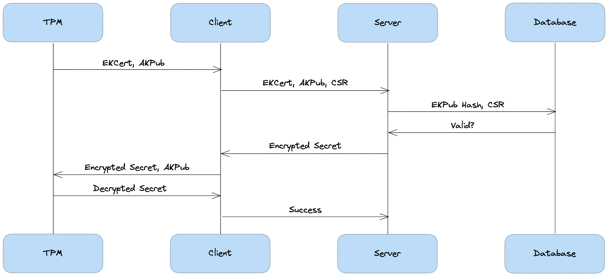

# TPM Attestation for Distributed Edge Computing

This is a project demonstrating leveraging the TPM remote attestation protocol to provision [SPIFFE X.509 SVIDs](https://spiffe.io/docs/latest/spiffe-about/spiffe-concepts/). Most of the work was done for the 2022 [Student Design Competition on Networked Computing at the Edge](https://smile-sdsu.github.io/cps_iot22/) and is meant to demonstrate how painless it can be to generate short-lived X.509 certificates to support mTLS at the edge.

## Quick Start

### Dependencies

* Go 1.18

### Building

A Dockerfile is provided if a container is desired, but to build binaries for your local architecture:

```bash
make
```

### Running

The server binary will expose a gRPC server listening for TPM attestation challenges

```bash
# Starts listening on port 8080 by default
./server
```

The client binary will send a TPM attestation request to a specific server. Since it needs to interact with the TPM, it needs to be run with elevated privileges.

```bash
# Sends an attestation request to localhost:8080 by default
sudo ./client -insecure
# If the target supports TLS the -insecure flag can be dropped
sudo ./client -host "cloud.run.app:443"
```

### Regenerating protobuf code

This requires additional dependencies - if you use the [nix](https://nixos.org/) package manager, a flake is provided to get these setup.

* protobuf v3.19.0
* protoc-gen-go v1.27.1
* protoc-gen-go-grpc v1.2.0

If the protobuf definitions are modified, the generated code will need to be updated:

```bash
make gen
```

## TPM Attestation Protocol


